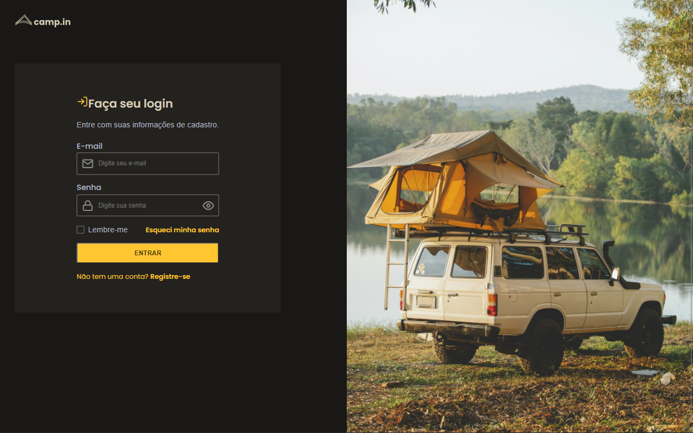

<h1 align="center">📋 Login Form</h1>

This project was created from Rocketseat challenge

- <a href="https://www.rocketseat.com.br/">For more information</a> 
- <a href="https://www.figma.com/file/JXeJDaiM0FipCzU7mwtpdj/DD-%2F-Login-Form---CSS-(Copy)?node-id=216%3A2">Figma for reference</a>
- <a href="https://efficient-sloth-d85.notion.site/Desafio-Login-Form-CSS-a10caea5a183494e97eb9ce4f33536b3">Original challenge</a>

<h2>⚙️Tecnologias</h2>

<h2>❔ How to Use </h2>

Before cloning the repository into your machine you'll need <a href="https://git-scm.com/">Git</a>. Also it is good to have a code editor like <a href="https://code.visualstudio.com/">VSCode.</a>

<h2>😈 Author </h2>

Made with ❤️ by Gustavo Barboza

<h3>☎️ Get in touch:</h3> 

   
   

